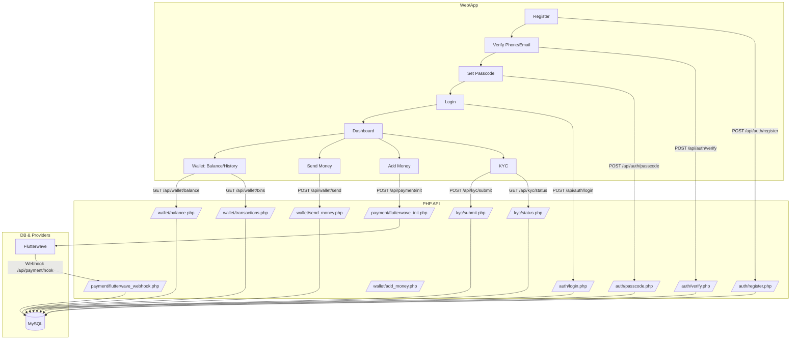

# 💸 Flowpesa — Save. Send. Grow. Together.

**Flowpesa** is a modern Africa-first fintech wallet built for everyday people and small communities (SACCOs, traders, and mobile workers).  
It enables users to **send, receive, save, and grow** their money seamlessly through **mobile money, bank, card, and agent channels** — starting with Uganda 🇺🇬.

---

## 🚀 Features

- 🌍 **Multi-channel deposits** — via bank, mobile money, agent, or card  
- 💸 **Peer-to-peer transfers** — send to contacts, @Flow tags, or bank accounts  
- 🏦 **SACCO saving groups** — community pots and personal goals  
- 🧠 **KYC tiers** — unlock higher limits with identity verification  
- 🧾 **Transaction receipts** — every action is timestamped and traceable  
- 💬 **In-app support** — chat and ticket history for transparency  

---

## 🧱 Project Structure (Planned)

```bash
Flowpesa/
│
├── api/
│   ├── db.php               → database connection (PDO or MySQLi)
│   ├── helpers.php          → shared functions (sanitize, generate TXN IDs, etc.)
│   ├── auth/
│   │   ├── register.php
│   │   ├── login.php
│   │   └── logout.php
│   ├── wallet/
│   │   ├── balance.php
│   │   ├── transactions.php
│   │   ├── send_money.php
│   │   └── add_money.php
│   ├── kyc/
│   │   ├── submit.php
│   │   ├── status.php
│   │   └── verify.php
│   ├── payment/
│   │   ├── flutterwave_init.php
│   │   ├── flutterwave_webhook.php
│   │   └── banks.php
│   ├── admin/
│   │   ├── users.php
│   │   ├── transactions.php
│   │   └── kyc.php
│   └── index.php            → main API router
│
├── public/
│   ├── index.php            → landing or redirect
│   ├── login.php
│   ├── register.php
│   ├── dashboard.php
│   ├── wallet.php
│   └── kyc.php
│
├── assets/
│   ├── css/
│   ├── js/
│   └── images/
│
└── .env or config.php        → DB creds, API keys, constants
```

## 🔄 Flow Chart (High-Level)



## 🛠️ API Plan (Endpoints)

- Auth
  - `POST /api/auth/register` → start registration (phone/email)
  - `POST /api/auth/login` → passcode/token login
  - `POST /api/auth/logout` → invalidate token
- Wallet
  - `GET /api/wallet/balance` → current balance
  - `GET /api/wallet/transactions` → paginated history
  - `POST /api/wallet/send` → P2P transfer
  - `POST /api/wallet/add` → add money (delegates to payment init)
- KYC
  - `POST /api/kyc/submit` → upload data/files
  - `GET /api/kyc/status` → tier and review state
- Payments (Flutterwave)
  - `POST /api/payment/init` → create payment intent
  - `POST /api/payment/webhook` → verify + credit wallet
- Admin
  - `GET /api/admin/users` | `GET /api/admin/transactions` | `GET /api/admin/kyc`

Notes
- Use `Authorization: Bearer <token>` on protected routes.
- All responses JSON: `{ success, data, error }`.
- Centralize DB access in `api/db.php` and helpers in `api/helpers.php`.

## 🔐 Registration Flow

- `create-account.html` → `verify-phone.html` → `verify-email.html` → `set-passcode.html` → `confirm-passcode.html` → `verify-id-citizenship.html` → `verify-id-consent.html` → `verify-id-type.html` → `upload-…`

---

## ⚙️ Tech Stack

| Layer | Technology |
|-------|-------------|
| **Frontend** | HTML5, CSS3 (Inter & Poppins fonts) |
| **Styling** | Responsive Flex/Grid, Dark-mode design |
| **Backend (planned)** | PHP + MySQL + Flutterwave API |
| **Version Control** | Git & GitHub |
| **Deployment** | Test server → `test.flowpesa.com` |


## 🪄 UI/UX Principles

- **Simple > Fancy:** 3 taps to finish any action  
- **Trust by default:** visible balances, fees, receipts  
- **Offline-friendly:** lightweight pages, low data use  
- **Local-first:** tailored for African mobile networks  
- **Consistency:** unified spacing, color tokens, typography  

---

## 🌐 Integration Roadmap

- [x] Onboarding + Auth screens (HTML/CSS)
- [ ] Flutterwave payment integration  
- [ ] API endpoint for signup/login  
- [ ] KYC tier flow (Tier 0 → Tier 2)  
- [ ] Admin dashboard  

---

## 🔒 Passcode Setup Flow

- Create passcode (`set-passcode.html`, `Js/set-passcode.js`)
  - User enters 6 digits.
  - When complete, store `sessionStorage.fp_first_passcode` and route to `confirm-passcode.html`.

- Confirm passcode (`confirm-passcode.html`, `Js/confirm-passcode.js`)
  - Compare input with `sessionStorage.fp_first_passcode`.
  - If mismatch: show red message + shake animation; let user try again.
  - If match: clear `fp_first_passcode` and continue to `verify-id-citizenship.html`.

Notes
- `verify-id-citizenship.html` is the intended next step and can be added later.
- Store only salted+hashed passcodes server‑side; client storage is temporary UX only.

### API Wiring (on Confirm success)

- Endpoint: `POST /api/auth/passcode/set`
- Request (JSON):
  - `phone`: `string` (e.g., `+256700000000`)
  - `passcode`: `string` (6 digits)
  - `client`: `"web" | "android" | "ios"`
  - `device_fingerprint` (optional): `string`
- Response (200 JSON):
  - `token`: `string` (JWT or opaque)
  - `next`: `string` (e.g., `"verify-id-citizenship.html"`)
- Errors: `400` invalid payload, `401` unauthorized/expired session, `409` passcode already set

Optional hardening later
- Challenge/response: server issues `{ salt_id, salt }`; client submits `{ phone, passcode_hash = sha256(passcode+salt), salt_id }`.

---

## 🧩 Branding

- **Primary color:** `#1682F9` (Teal-blue)  
- **Accent:** Dark gray `#111111`, white text  
- **Fonts:** [Inter](https://fonts.google.com/specimen/Inter) / [Montserrat](https://fonts.google.com/specimen/Montserrat)  
- **Tagline:** *Save. Send. Grow — Together.*

---

## 🤝 Contributing

Pull requests are welcome!  
If you’d like to contribute, fork the repository and open a PR with a clear description of what you’ve improved (UI/UX, integration, bug fix, etc).

---

## 🛡️ License

This project is under the **MIT License** — feel free to adapt for learning or personal use.

---

screenshots
Logo first show up as the preloader


dashboard


### 👑 Author
**Gerald Jamisco**  
Fintech Developer & Founder — Flowpesa  
📧 [gjamisco@flowpesa.com](mailto:gjamisco@flowpesa.com)

---

> “Built for Africa, made for you.”
